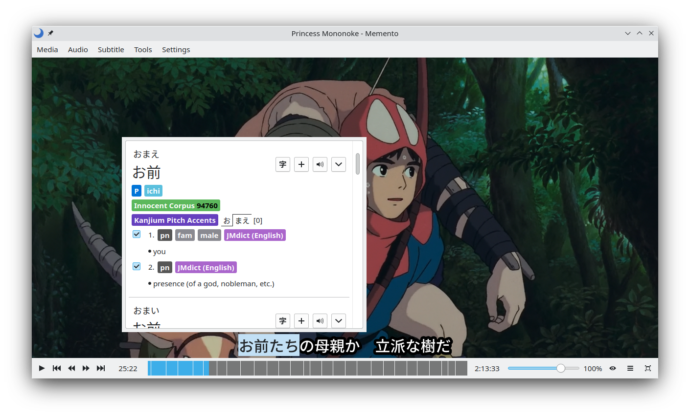

# Memento

## Overview

Memento is a FOSS, mpv-based video player intended for studying Japanese.



## Features

* Grammar aware subtitle search
* Yomichan-style Kanji cards
* Support for Yomichan dictionaries (except pitch accent dictionaries like Kanjium)
* Anki card creation through [AnkiConnect](https://ankiweb.net/shared/info/2055492159)
* Support for mpv upscalers, plugins, and configuration files

## Dictionaries

*   **[JMdict](https://www.edrdg.org/jmdict/edict_doc.html)** (Japanese vocabulary)
    *   [jmdict\_dutch.zip](https://foosoft.net/projects/yomichan/dl/dict/jmdict_dutch.zip)
    *   [jmdict\_english.zip](https://foosoft.net/projects/yomichan/dl/dict/jmdict_english.zip)
    *   [jmdict\_french.zip](https://foosoft.net/projects/yomichan/dl/dict/jmdict_french.zip)
    *   [jmdict\_german.zip](https://foosoft.net/projects/yomichan/dl/dict/jmdict_german.zip)
    *   [jmdict\_hungarian.zip](https://foosoft.net/projects/yomichan/dl/dict/jmdict_hungarian.zip)
    *   [jmdict\_russian.zip](https://foosoft.net/projects/yomichan/dl/dict/jmdict_russian.zip)
    *   [jmdict\_slovenian.zip](https://foosoft.net/projects/yomichan/dl/dict/jmdict_slovenian.zip)
    *   [jmdict\_spanish.zip](https://foosoft.net/projects/yomichan/dl/dict/jmdict_spanish.zip)
    *   [jmdict\_swedish.zip](https://foosoft.net/projects/yomichan/dl/dict/jmdict_swedish.zip)
*   **[JMnedict](https://www.edrdg.org/enamdict/enamdict_doc.html)** (Japanese names)
    *   [jmnedict.zip](https://foosoft.net/projects/yomichan/dl/dict/jmnedict.zip)
*   **[KireiCake](https://kireicake.com/rikaicakes/)** (Japanese slang)
    *   [kireicake.zip](https://foosoft.net/projects/yomichan/dl/dict/kireicake.zip)
*   **[KANJIDIC](http://nihongo.monash.edu/kanjidic2/index.html)** (Japanese kanji)
    *   [kanjidic\_english.zip](https://foosoft.net/projects/yomichan/dl/dict/kanjidic_english.zip)
    *   [kanjidic\_french.zip](https://foosoft.net/projects/yomichan/dl/dict/kanjidic_french.zip)
    *   [kanjidic\_portuguese.zip](https://foosoft.net/projects/yomichan/dl/dict/kanjidic_portuguese.zip)
    *   [kanjidic\_spanish.zip](https://foosoft.net/projects/yomichan/dl/dict/kanjidic_spanish.zip)
*   **[Innocent Corpus](https://web.archive.org/web/20190309073023/https://forum.koohii.com/thread-9459.html#pid168613)** (Term and kanji frequencies across 5000+ novels)
    *   [innocent\_corpus.zip](https://foosoft.net/projects/yomichan/dl/dict/innocent_corpus.zip)

## Dependencies

* Qt5
* ffmpeg
* mpv
* sqlite3
* MeCab
* Json-C
* libzip
* Qt DBus (Linux)

For the best experience, install [Noto Sans JP](https://fonts.google.com/specimen/Noto+Sans+JP)
and the [Kanji Stroke Order](https://drive.google.com/uc?export=download&id=1oyQoTB531tbhlYaOW7ugvutXZ7HSlJfW) fonts.

## Building

### Linux

To install Memento on Linux, type the following commands:

```
make
sudo make install
```

### Windows

1. Install [MSys2](https://www.msys2.org/)
1. Make sure MSys2 is up to date by running these commands:
    ```
    pacman -Sy --needed msys2-runtime pacman
    pacman -Su
    ```
1. Install the necessary tools and dependencies:
    ```
    pacman -S git mingw-w64-x86_64-gcc mingw-w64-x86_64-make mingw-w64-x86_64-cmake mingw-w64-x86_64-ffmpeg mingw-w64-x86_64-sqlite3 mingw-w64-x86_64-qt5 mingw-w64-x86_64-mpv mingw-w64-x86_64-mecab mingw-w64-x86_64-json-c mingw-w64-x86_64-libzip
    ```
1. Clone the repository:
    ```
    git clone https://github.com/ripose-jp/Memento.git
    ```
1. Build Memento:
    ```
    cd Memento
    ./windows-build.sh x86_64
    ```
1. The resulting file will be in
    ```
    build/Memento_x86_64
    ```

## Configuration

Most mpv shaders, plugins, and configuration files will work out of the box.
The Memento config directory is located at:

### Linux
```
~/.config/memento
```

### Windows
```
[installation directory]\config
```

If any mpv binds or plugins do not work, please create an issue in the issue
tracker.

## To-do

* Compile an OS X version.

## Acknowledgements

MpvWidget code is based off of libmpv example code by w4m.

https://github.com/mpv-player/mpv-examples/tree/master/libmpv/qt_opengl

Some code based off of Baka-MPlayer.

https://github.com/u8sand/Baka-MPlayer

UI inspired by and dictionaries provided by Yomichan.

https://foosoft.net/projects/yomichan/

This project uses icons made by Georgiana Ionescu for the Noun Project.

https://thenounproject.com/georgiana.ionescu/

Plus, minus, back, up, down, and hamburger button images were sourced from here.

https://www.iconfinder.com/iconsets/ionicons